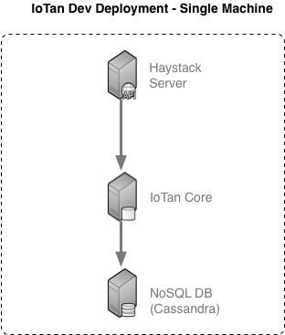
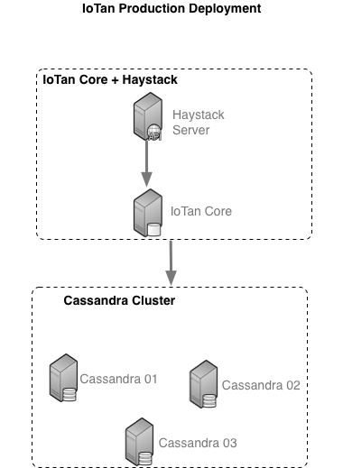
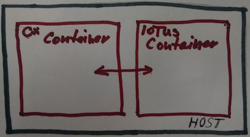

# IoTan (IoT Analytics System)

## Intro

IoTan is a set of components and infrastructure for IoT data acquisition,
storage and analysis.

IoTan core is developed is scala and can leverage existing Java libraries
that help building domain components, such as haystack-java.

In version 0.1, IoTan uses Haystack protocol and concepts as the primary
 way to ingest and serve data.

Clients can interface to IoTan using haystack client or scala based
API from scala ir sbt console.

IoTan Core currently uses Cassandra database as store (a future version may 
support MongoDB). Before IoTan can be made operational, Cassandra has 
to be setup.

Note: some iotan-related names within the project use "iotus" instead of 
"iotan", which is an older name of the project. This will eventually change.

## Architecture 

In version 0.1, IoTan offers Cassandra as data store. It can be deployed
on a single virtual or physical machine in development mode, on two
machines on Docker conainters, or on several machines in production,
in which case Cassandra cluster of 3 or more nodes would be used.

------

***Dev Deployment Example***:




------

***Production Deployment Example***:



Please see roadmap below for future architecture and feature plans.

## Cassandra setup


See http://planetcassandra.org/cassandra/

Note on cqlsh:

With some version of cqlsh, when connecting to C* 3.9, you need to specify
cqlversion option:

    cqlsh --cqlversion="3.4.2" 

### Passing Cassandra Tests


cqlsh
CREATE KEYSPACE IF NOT EXISTS test WITH replication = { 'class': 'SimpleStrategy', 'replication_factor': 1 };

### Cassandra Iotus Keyspace and Database

For Cassandra test to pass, a test and iotus keyspaces needs to be created
and the databased initialized. For LDAP tests to succeed, LDAP server
has to be setup.

1. For Cassandra IoTan database, create iotus keyspace and init the db:

    cqlsh [hostname] 
    CREATE KEYSPACE IF NOT EXISTS iotus WITH replication = { 'class': 'SimpleStrategy', 'replication_factor': 1 };

2. Then run schema and populate script. See ./db

cqlsh [hostname] < db/iotus-schema.cql
cqlsh [hostname] < db/iotus-populate.cql

### Putting It All Together

You can execute cqlsh commands like in this example (using hostname u16
and keyspace iotus)
 
    # set proper path to CQLSH if needed
    #export CQLSH=~/.ccm/repository/3.9/bin/cqlsh.py
    export CQLSH=cqlsh
    # create namespace for testing with one host (for production, see 
    #  iotus-keyspace-prod.cql
    # $CQLSH u16 -k iotus_simple -e "USE iotus_simple;"
    $CQLSH u16 -e "CREATE KEYSPACE iotus WITH replication = { 'class': 'SimpleStrategy', 'replication_factor': 1 };"
    for f in iotus-schema.cql iotus-populate.cql; do
      $CQLSH u16 -k iotus_simple -f $f
    done
    
    
### Building Library and Other sbt Options


1) Build library jar

    sbt package

The resulting files will be placed in target, e.g. like this:
./target/scala-2.11/iotus-core_2.11-0.1.01-SNAPSHOT.jar

    sbt compile: compile sources
    sbt test: run tests
    sbt console: prepare for command line scala execution


2) package all dependency jars. This can be used to execute from a java project, such as iotan-hs
  Resulting jars will be in ./target/pack/lib

    sbt pack
    
    ls -l ./target/pack/lib
    
    total 132248
    -rw-r--r--  1 peter  staff   2064728 Apr 21  2014 argonaut_2.11-6.0.4.jar
    -rw-r--r--  1 peter  staff    990392 Jan 28  2016 cassandra-driver-core-3.0.0.jar
    -rw-r--r--  1 peter  staff    575389 Apr 14  2008 commons-collections-3.2.1.jar
    -rw-r--r--  1 peter  staff    354491 Jan 27  2012 commons-configuration-1.8.jar
    ...

3) assembly: package all dependencies into one fat-jar
  This needs work since it generates an exception related to dupliates in io.netty:

    sbt assembly
    ...
    java.lang.RuntimeException: deduplicate: different file contents found in the following:
    /Users/peter/.ivy2/cache/io.netty/netty-handler/jars/netty-handler-4.0.33.Final.jar:META-INF/io.netty.versions.properties
    /Users/peter/.ivy2/cache/io.netty/netty-buffer/jars/netty-buffer-4.0.33.Final.jar:META-INF/io.netty.versions.properties
    ...

### Quick Test

If all built and db has been created and populated like above, then make sure iotus.yaml
config file is setup properly, e.g. pointing to the proper db url,
something like:

    db: cassandra://localhost:9042/iotus

or

    db: cassandra://localhost:u16/iotus_simple


and then run from sbt console:

    import iotus.core.IMContext
    import iotus.core.IMFrame
    // create a context and perform a query
    val ctx = new IMContext("test-project", "frank@michalek.org", "point").readAll()
    ctx.toGrid.dump
    // try another query
    ctx.clear.readAll("site").toGrid.dump

If database errors are displayed, it means the db has not been properly
initialized.


## Deployment

### Setting up LDAP Server

Note: this is needed only if you prefer LDAP autentications instead of
database user table based authentication.

Use OpenLDAP related resource to install LDAP.

After installation, verified connectivity before setting up parameters in your config file iotus.conf
and test file src/resources/application.conf

E.g. use ldapsearch to verify. Here is an example (replace 'admin', example, uid etc. with correct values:

```bash
    ldapsearch -w {adminPassword} -h ldap.example.com -D 'cn=admin,dc=example,dc=com'    -b 'dc=example,dc=com' "uid=frank"
```

### First Time Deployment

When deploying for the first time on development or production system, 
create iotan user, to run as instead of root, a target configuration 
and related directory structure.

As sudo root, create iotan user and setup configuration

    adduser iotan
    # folow the instructions to setup use account
    mkdir -p /opt/iotus
    chown iotan:iotus /opt/iotus

    # as user iotus
    mkdir -p /opt/iotus/conf

    cp conf/iotus-template.yaml /opt/iotus/conf/iotus.yaml
    # adjust configuration to point to the correct db and possibly ldap
    vi /opt/iotus/conf/iotus.yaml

### Setup Using Docker

There will be two docker container needed, one for cassandra, using 
standard docker library and one for IoTan core and haystack server.


Therefore the docker runtime container deployment may look like this,
with two docker containers on one host.

***Docker Dev Deployment***:




Also see 
    
    ./docker
    ./lucene

To run a single development instance of Cassandra via docker:
    
```bash
# --- start cassandra container and copy lucene jar
# If this is the first time on this docker system
#   it will take a while to download
docker run --name cass01 -d cassandra:3.9
# copy lucene jar file for lucene text search indexing support 
docker cp lucene/cassandra-lucene-index-plugin-3.9.5.jar cass01:/usr/share/cassandra/lib/
# restart container
docker restart cass01

# --- create keyspace and schema
# a) first, copy files to docker container
# use docker container name from above, such as cass01
CASS_NAME=cass01
docker cp docker/populate_db.py $CASS_NAME:/tmp
docker exec -i $CASS_NAME sh -c 'mkdir -p /tmp/dev'
for f in docker/dev/*; do
  docker cp $f $CASS_NAME:/tmp/dev
done
# b) execute populate
docker exec -i $CASS_NAME sh -c '/tmp/populate_db.py -s localhost iotus'
```


Alternatively, the run command above could look like this if you'd 
like to preserve and archive the data on the host:

    docker run --name cass01 -v /my/own/datadir:/var/lib/cassandra -d cassandra:3.9
    
To run IoTan core and Haystack server from docker repo.
    
    docker run --link cass01 --env CASSANDRA_HOST=cass01 -p 1225:1225 --name iotan01 -d petermic/iotan:0.1
    
Default values for environment variables:
CASSANDRA_HOST=cassandra

The docker run command above will start iotan-core service and iotus 
haystack server, connecting to the running cassandra container cass01. 
During initialization, it will create proper /opt/iotus/conf/iotus.yaml 
file for that and will initialize cassandra keyspace "simple" and 
pre-populate it will a default user, admin id and password as specified 
and project "simple" as described in the documentation.

With the arguments above, the haystack server will be available on the 
docker IP for that instance at port 1225 and can be tested like this.
Note the default password for the user admin@admin.org setup by 
docker auto-setup. Another user is also setup (see below)

    # find out the IP
    SIPD=$(docker inspect --format {{.NetworkSettings.IPAddress}} iotuscore01)
    # perform test via un-authenticated about request
    curl http://$SIPD:1225/api/about
    # it can do an authenticated request to query points, like this:
    curl -u admin@admin.org:4dmin123 http://$SIPD:1225/api/simple/read?filter=equip
    # you will get a response tht looks something like this:
    ver:"2.0"
    id,equip,tz,navName,siteRef,origId,dis
    @2c34a5f0-e329-4f6e-a679-00ac3b97ee3a "Office RTU-1",M,"Las_Vegas","RTU-O-01",@a688156f-9584-49ec-9fb2-dc3b3e565bd6,"Office.RTU-1","Office RTU-1"
    @9d244671-4216-4578-97e6-208d04a96ab9 "Office RTU-2",M,"Las_Vegas","RTU-O-02",@a688156f-9584-49ec-9fb2-dc3b3e565bd6,"Office.RTU-2","Office RTU-2"
    @cb24697d-0f7d-403c-bd05-5a9ae05d53cf "Home ElecMeter-Main",M,"Los_Angeles","ElecMeter-Main",@32cb5eca-b8b1-47cd-88ee-b9fd26e1f4b6,"Home.ElecMeter-Main","Home ElecMeter-Main"
    # or
    curl -u admin@admin.org:4dmin123 http://localhost:1225/api/simple/read?filter=site
    # you will get a response tht looks something like this:
    ver:"2.0"
    id,area,geoAddr,geoCity,site,tz,geoState,geoStreet,geoPostalCode,origId,dis,geoCountry
    @32cb5eca-b8b1-47cd-88ee-b9fd26e1f4b6 "Home",3000,"10800 Torre Ave, Cupertino, CA 95014","Cupertino",M,"Los_Angeles","CA","600 W Main St","95014","Home","Home","US"
    @a688156f-9584-49ec-9fb2-dc3b3e565bd6 "Office",6000,"900 N Roop St, Carson City, NV 89701","Carson City",M,"Las_Vegas","NV","3504 W Cary St","89701","Office","Office","US"
    
    
#### What Happens During Init

When iotuscore docker container is started for the first time via "docker run"
 command, the entrypoint.sh is invoked which peforms three actions:

* initializes the database if needed
* populates a sample project called "simple" if it doesn't exist yet
* start haystack server

The first two steps may be skipped it it's detected the database already
contains the needed information.


Initializing the database consists of these steps:

* keyspace is created if it doesn't exist yet
* schema if created for the given keyspace
* two users are created: admin and guest (admin@admin.org, guest@example.org)


##### ProjectBuilder

For the sample project "simple", guest has read access and
  admin has read/write access (i.e. haystack hisWrite will work only
  for the admin user).
  
The "simple" project has several site, equip and point nodes that can be queried
via iotus scala API or haystack client
  
If needed, additional project with the same content could be created via
ProjectBuilder script, like this (this uses "myproject" project name
and an existing sample zinc file to populate a few site, equip and 
point records:

./srepl.sh docker/project_populate.scala  myproject America/Log_Angeles ./src/main/resources/iotus-simple.zinc false

### Building Docker Images

To build the docker image for IoTan core and haystack server, you'll 
first need to create supporting tarballs, like this:

1) build core and hs projects and dependencies, e.g. like this:

    cd iotan-core
    sbt compile pack
    ./dpack.sh
    cd ../iotan-hs
    ./gradlew build && ./deploy.sh 
    ./dpack.sh
    cd ..

2) copy binaries to docker directory

    cp iotan-core/iotus-core-bin-0.1.01.tar.gz iotan-core/docker
    cp iotan-hs/iotus-hs-bin-0.1.01.tar.gz iotan-core/docker
    cp iotan-hs/iotus-hs-bin-deps-0.1.01.tar.gz iotan-core/docker
    
3) download scala 2.11.8 from https://www.scala-lang.org/download/2.11.8.html
  to docker directory
    
    ls -l 
    -rw-r--r-- 1 peter dev 28678231 Mar  4  2016 scala-2.11.8.tgz

4) now build the docker, e.g. like this
    
    cd iotan-core/docker
    docker build --tag myiotan:0.1 .
    
### Testing IoTan Scala Core on Docker
    
    docker run -it --link cass01 --env CASSANDRA_HOST=172.17.0.2 --rm petermic/iotan:0.1 sh -c 'exec /opt/iotus/iotan-hs/srepl.sh'    
    import iotus.core.IMContext
    val ctx = new IMContext("simple", "guest@example.org")
    #val ctx = new IMContext("demo", "guest@example.org")
    ctx.readAll("point").toGrid.dump

    # you'll get a frame back that looks something like this:
    ver:"2.0"
    id,equipRef,point,his,tz,dis,kind
    @756716f7-2e54-4715-9f01-91dcbea6c111 "demo pt 01",@756716f7-2e54-4715-9f01-91dcbea6c555,M,M,"New_York","demo pt 01","Number"
    @756716f7-2e54-4715-9f01-91dcbea6c222 "demo pt 02",@756716f7-2e54-4715-9f01-91dcbea6c555,M,M,"New_York","demo pt 02","Number"
    @756716f7-2e54-4715-9f01-91dcbea6c223 "demo pt 03",@756716f7-2e54-4715-9f01-91dcbea6c555,M,M,"New_York","demo pt 03","Number"

    
## Acknowledgements

IoTus uses Project Haystack concepts and java haystack open source
server and library for ingestion and output via haystack channel.

## Roadmap

After version 0.1, the following features are planned for v 0.2 and beyond:

* simple CLI commands to setup and manage projects, and import 
 .csv or .zinc data
* fine-grained group based permissions for project access
* tools for data scientists to analyze data
* add-on services to ingest and process data
* based on feedback possible support for MongoDB, in addition to Cassandra
  as a more lightweight deployment

## License

Apache 2.0
